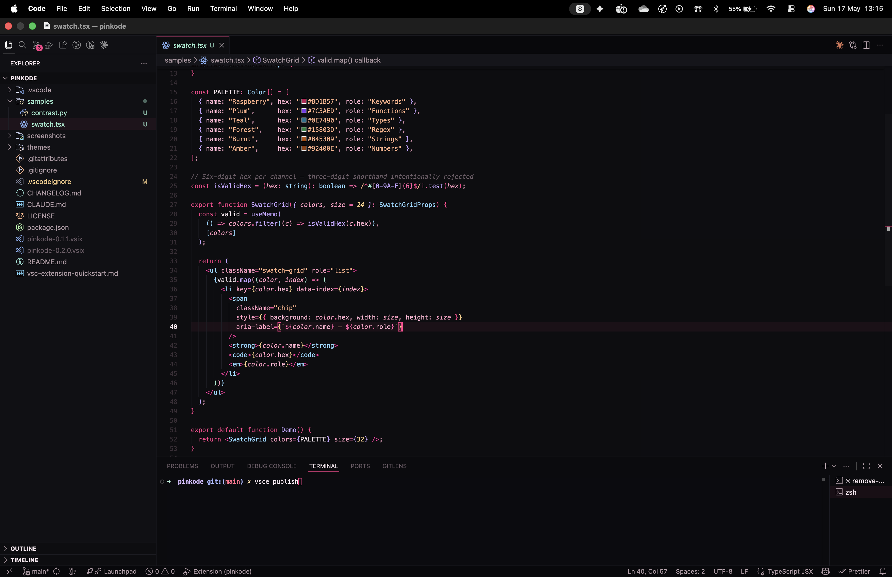
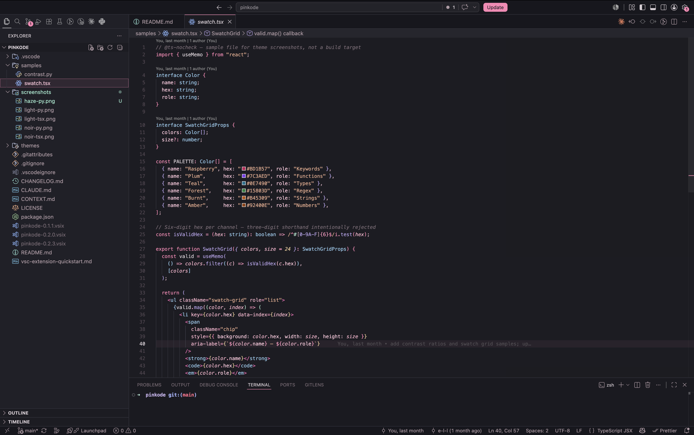
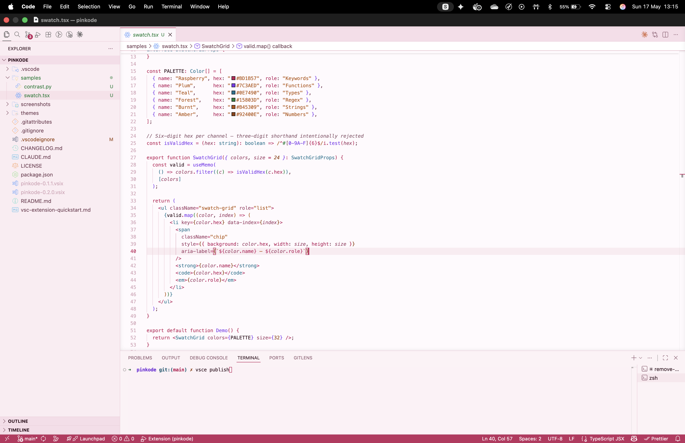
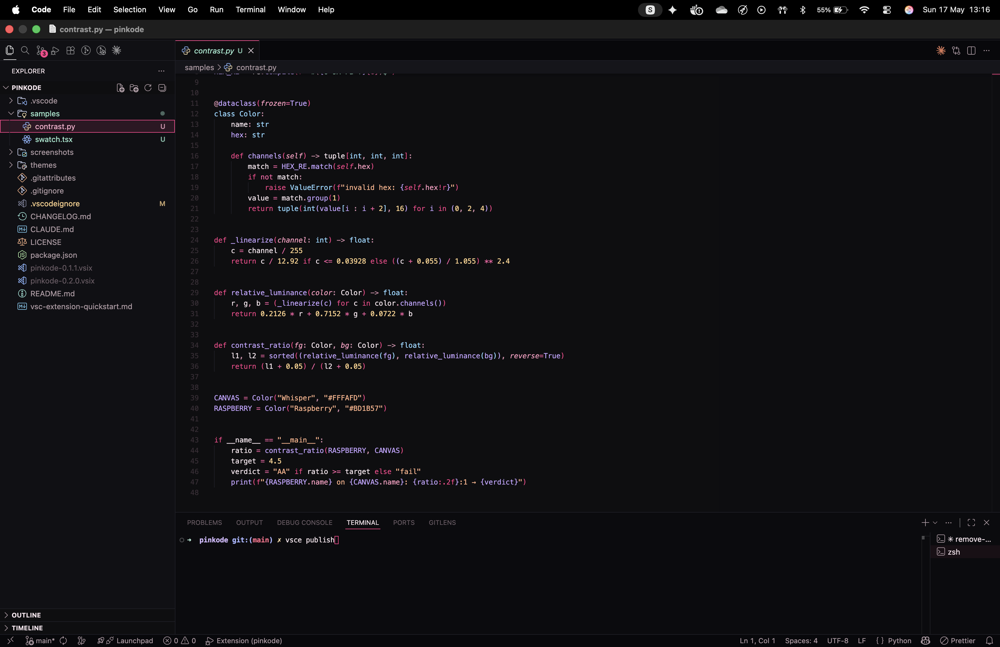
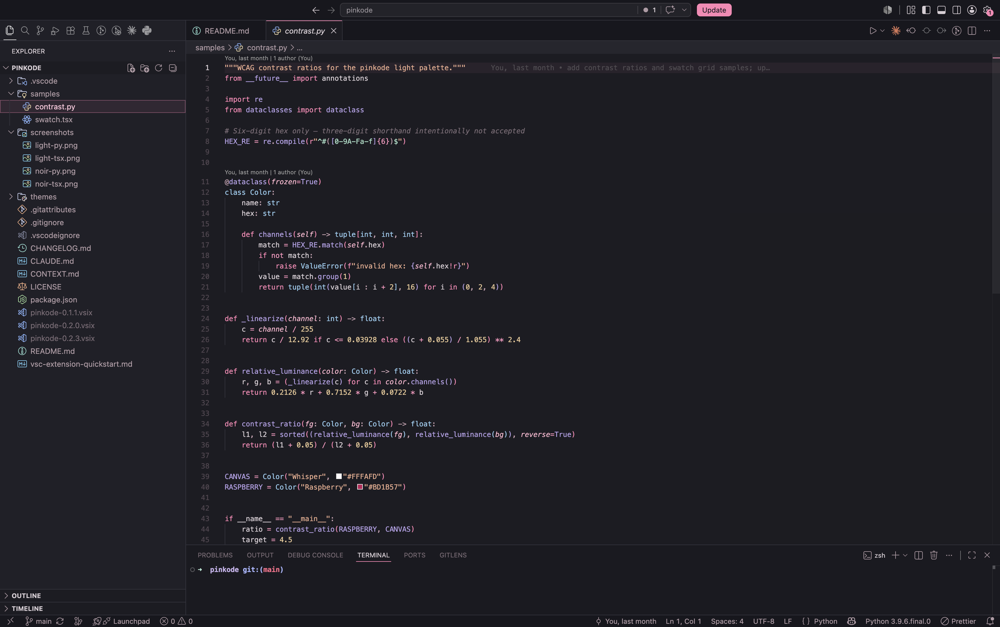
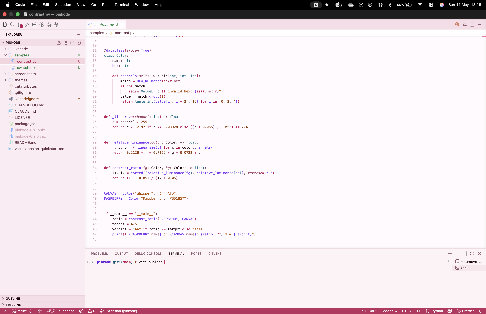

# pinkode

> A pink-forward VS Code theme. Three flavors — **Noir** for dark, **Haze** for low-contrast dark, **Light** for day. Raspberry pink does the heavy lifting; a curated complement palette covers the syntax range.

## Preview

| pinkode - noir | pinkode - haze | pinkode - light |
| :---: | :---: | :---: |
|  |  |  |
| near-black surfaces · bright pink accents | lifted grey surfaces · pastel pinks · low contrast | cream-and-rose surfaces · WCAG-AA syntax |

<details>
<summary>Python preview</summary>

| pinkode - noir | pinkode - haze | pinkode - light |
| :---: | :---: | :---: |
|  |  |  |

</details>

## Install

1. Open the Extensions view (`Cmd+Shift+X` / `Ctrl+Shift+X`)
2. Search for `Pinkode`
3. Install
4. `Cmd+K Cmd+T` (or `Ctrl+K Ctrl+T`) → pick **pinkode - noir**, **pinkode - haze**, or **pinkode - light**

Or from a `.vsix`:

```sh
code --install-extension pinkode-0.3.0.vsix
```

## Palette

<details>
<summary><strong>Noir</strong> — six surfaces, six pinks, six complements</summary>

### Surfaces — black + greys

| | Token | Hex | Role |
| :-: | --- | --- | --- |
|  | Void          | `#050507` | Window backdrop         |
|  | Activity Bar  | `#08080B` | Deepest chrome          |
|  | Editor        | `#0D0D11` | Main canvas             |
|  | Sidebar       | `#101015` | File tree, panels       |
|  | Elevated      | `#15151B` | Active tab, breadcrumb  |
|  | Input / Hover | `#1A1A22` | Form fields, hover      |

### Accents — the pinks

| | Token | Hex | Role |
| :-: | --- | --- | --- |
|  | Hot Pink    | `#FF3D8C` | Keywords · selection · brand |
|  | Magenta     | `#FF2DA0` | Tags · markup                |
|  | Neon Pink   | `#FF5FA8` | Operators                    |
|  | Rose        | `#F06292` | Hover · borders              |
|  | Blush       | `#FF9CC2` | Parameters · attributes      |
|  | Pastel Pink | `#FFB3D1` | Properties · selected text   |
|  | Dust Rose   | `#D18BA7` | Punctuation                  |

### Complements — for syntax range

| | Token | Hex | Role |
| :-: | --- | --- | --- |
|  | Lavender | `#C4A3FF` | Functions · constants · AI |
|  | Sky      | `#8DD6FF` | Types · classes            |
|  | Mint     | `#9EEBCF` | Regex · added · success    |
|  | Peach    | `#FFB088` | Strings · warnings         |
|  | Amber    | `#FFD28A` | Numbers · modified · find  |
|  | Whisper  | `#F4E4EC` | Primary text               |

### Semantic

| | Token | Hex |
| :-: | --- | --- |
|  | Error   | `#FF3D6D` |
|  | Warning | `#FFB088` |
|  | Info    | `#8DD6FF` |
|  | Success | `#9EEBCF` |

</details>

<details>
<summary><strong>Haze</strong> — low-contrast noir: lifted greys, pastel pinks, loud signals</summary>

Noir's hue identity at smaller contrast deltas — surfaces lifted off black, text off pure-white, pinks and complements softened (editor canvas↔text drops from ~15:1 to ~9:1). Status signals (error/warning/info/success, find, diff, git) keep Noir's full-strength values, so a syntax complement and its matching status color **diverge** here — e.g. strings use Peach `#ECAC8E` while a warning stays `#FFB088`.

### Surfaces — lifted greys

| | Token | Hex | Role |
| :-: | --- | --- | --- |
|  | Void          | `#131318` | Window backdrop        |
|  | Activity Bar  | `#17171D` | Deepest chrome         |
|  | Editor        | `#1C1C22` | Main canvas            |
|  | Sidebar       | `#202027` | File tree, panels      |
|  | Elevated      | `#26262E` | Active tab, breadcrumb |
|  | Input / Hover | `#2C2C36` | Form fields, hover     |

### Accents — pastel pinks

| | Token | Hex | Role |
| :-: | --- | --- | --- |
|  | Hot Pink    | `#FF85B5` | Keywords · selection · brand |
|  | Magenta     | `#FF6FBE` | Tags · markup                |
|  | Neon Pink   | `#FF96C0` | Operators                    |
|  | Rose        | `#E58BA8` | Hover · borders              |
|  | Blush       | `#FFB6D0` | Parameters · attributes      |
|  | Pastel Pink | `#FFC8DD` | Properties · selected text   |
|  | Dust Rose   | `#C79FAF` | Punctuation                  |

### Complements — dimmed, kept distinct

| | Token | Hex | Role |
| :-: | --- | --- | --- |
|  | Lavender | `#B6A0E8` | Functions · constants · AI |
|  | Sky      | `#93C9EC` | Types · classes            |
|  | Mint     | `#A6DEC6` | Regex · escapes (syntax)   |
|  | Peach    | `#ECAC8E` | Strings (syntax)           |
|  | Amber    | `#E8C794` | Numbers (syntax)           |
|  | Whisper  | `#D8CDD4` | Primary text               |

### Semantic — kept at Noir strength

| | Token | Hex |
| :-: | --- | --- |
|  | Error   | `#FF3D6D` |
|  | Warning | `#FFB088` |
|  | Info    | `#8DD6FF` |
|  | Success | `#9EEBCF` |

</details>

<details>
<summary><strong>Light</strong> — AA-tuned, contrast ratios annotated</summary>

Every syntax token clears WCAG AA (≥4.5:1) on `#FFFAFD`. Every accent annotated with its contrast ratio. Pastel stays on surfaces — never text.

### Surfaces — cream + rose

| | Token | Hex | Role |
| :-: | --- | --- | --- |
|  | Petal         | `#F9E1EA` | Window backdrop               |
|  | Activity Bar  | `#F7DDE8` | Deepest chrome                |
|  | Whisper       | `#FFFAFD` | Main editor canvas            |
|  | Sidebar       | `#FBECF2` | File tree                     |
|  | Panel         | `#FDF2F6` | Panel · terminal              |
|  | Elevated      | `#FFFFFF` | Active tab inner · breadcrumb |
|  | Input / Hover | `#F4DBE5` | Form fields, hover            |

### Accents — the pinks (AA-safe except pastel)

| | Token | Hex | Role · Contrast on `#FFFAFD` |
| :-: | --- | --- | --- |
|  | Raspberry   | `#BD1B57` | Keywords · brand · cursor · 5.88:1    |
|  | Magenta     | `#B8175A` | Tags · properties · 6.15:1            |
|  | Neon Pink   | `#C42466` | Operators · 5.37:1                    |
|  | Rose        | `#BE2E5E` | Status bar (white fg) · 5.44:1        |
|  | Blush       | `#9E3F66` | Parameters · attributes · 6.06:1      |
|  | Pastel Pink | `#F4A8C2` | **Surface only** — never used as text |
|  | Dust Rose   | `#82475E` | Punctuation · 6.75:1                  |

### Complements — for syntax range

| | Token | Hex | Role |
| :-: | --- | --- | --- |
|  | Plum   | `#7C3AED` | Functions · constants · AI |
|  | Teal   | `#0E7490` | Types · classes            |
|  | Forest | `#15803D` | Regex · added · success    |
|  | Burnt  | `#B45309` | Strings · warnings · find  |
|  | Amber  | `#92400E` | Numbers · modified         |
|  | Ink    | `#2A0A17` | Primary text · 17.6:1      |

### Semantic

| | Token | Hex |
| :-: | --- | --- |
|  | Error   | `#C81E3A` |
|  | Warning | `#B45309` |
|  | Info    | `#0E7490` |
|  | Success | `#15803D` |

</details>

<details>
<summary><strong>Syntax token map</strong> — role → color, noir & light</summary>

**Haze** maps every role to the same accent _name_ as Noir, at the softened hexes in the Haze palette above — except status signals (diff added/removed/modified, error), which keep Noir's full-strength color. AI ghost text and inline hints soften with the rest.


| Role                          | Noir         | Light       |
| ----------------------------- | ------------ | ----------- |
| Keywords, control flow        | Hot Pink     | Raspberry   |
| `this` / `self` (italic)      | Hot Pink     | Raspberry   |
| Functions, function calls     | Lavender     | Plum        |
| Types, classes, interfaces    | Sky          | Teal        |
| Properties (`.scrollLeft`)    | Pastel Pink  | Magenta     |
| Parameters (italic)           | Blush        | Blush (dk)  |
| Strings                       | Peach        | Burnt       |
| Numbers                       | Amber        | Amber (dk)  |
| Language constants            | Lavender     | Plum        |
| Operators                     | Neon Pink    | Neon (dk)   |
| Punctuation                   | Dust Rose    | Dust Rose   |
| Comments (italic)             | `#6A5A64`    | `#8E5C70`   |
| Regex, escapes                | Mint         | Forest      |
| Tags                          | Magenta      | Magenta     |
| Attributes                    | Blush        | Blush (dk)  |
| Diff added                    | Mint         | Forest      |
| Diff removed                  | Error        | Error       |
| Diff modified                 | Amber        | Amber (dk)  |
| AI ghost text                 | Lavender     | `#A87890`   |
| Inline hints                  | Lavender     | Plum        |

</details>

## Open source

pinkode is MIT-licensed and lives on GitHub: https://github.com/e-l-l/pinkode

Issues, palette tweaks, and PRs welcome — open a [pull request](https://github.com/e-l-l/pinkode/pulls) or [file an issue](https://github.com/e-l-l/pinkode/issues) with a screenshot of what you'd like changed.

## License

MIT — see [`LICENSE`](./LICENSE).
